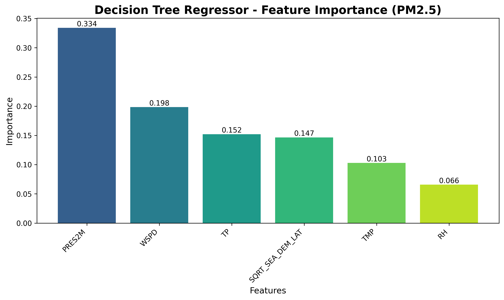
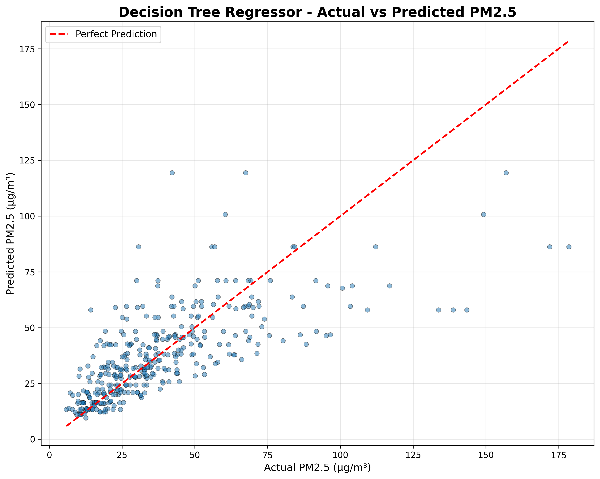
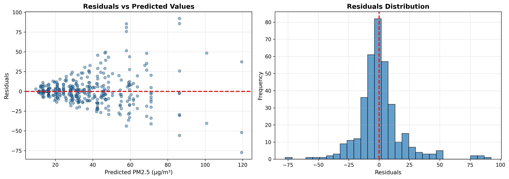
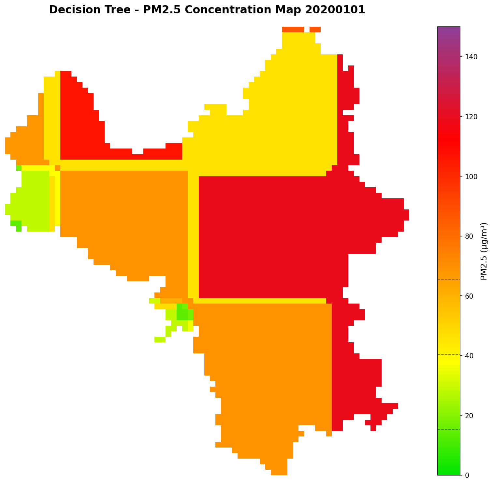
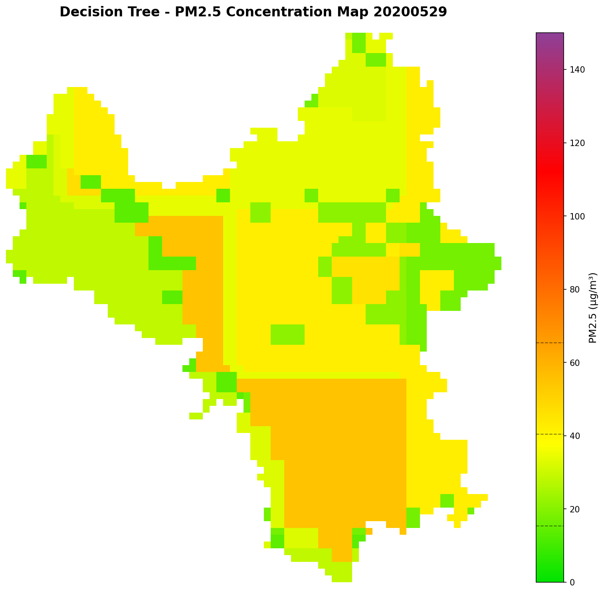
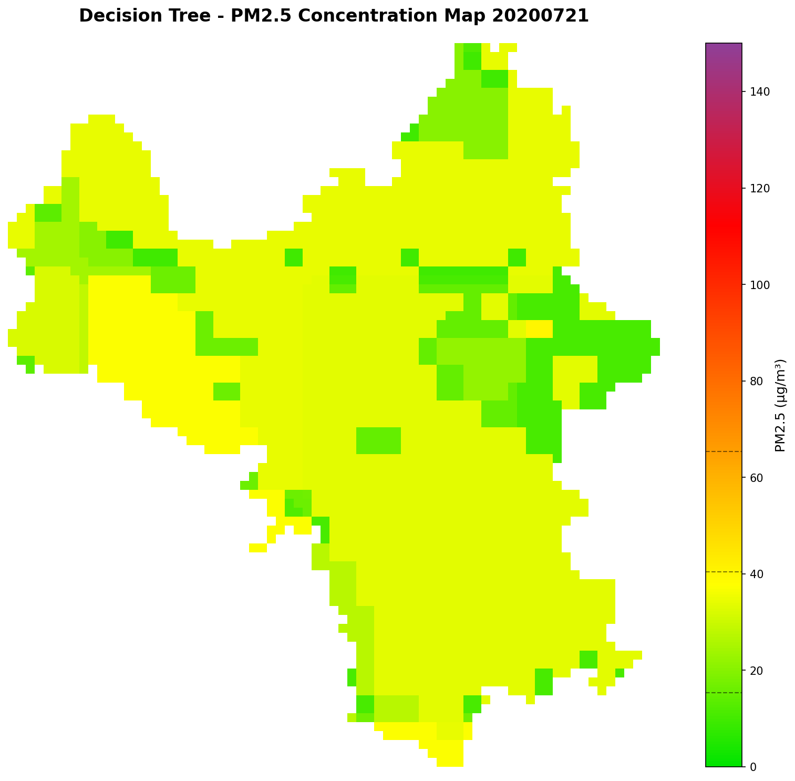
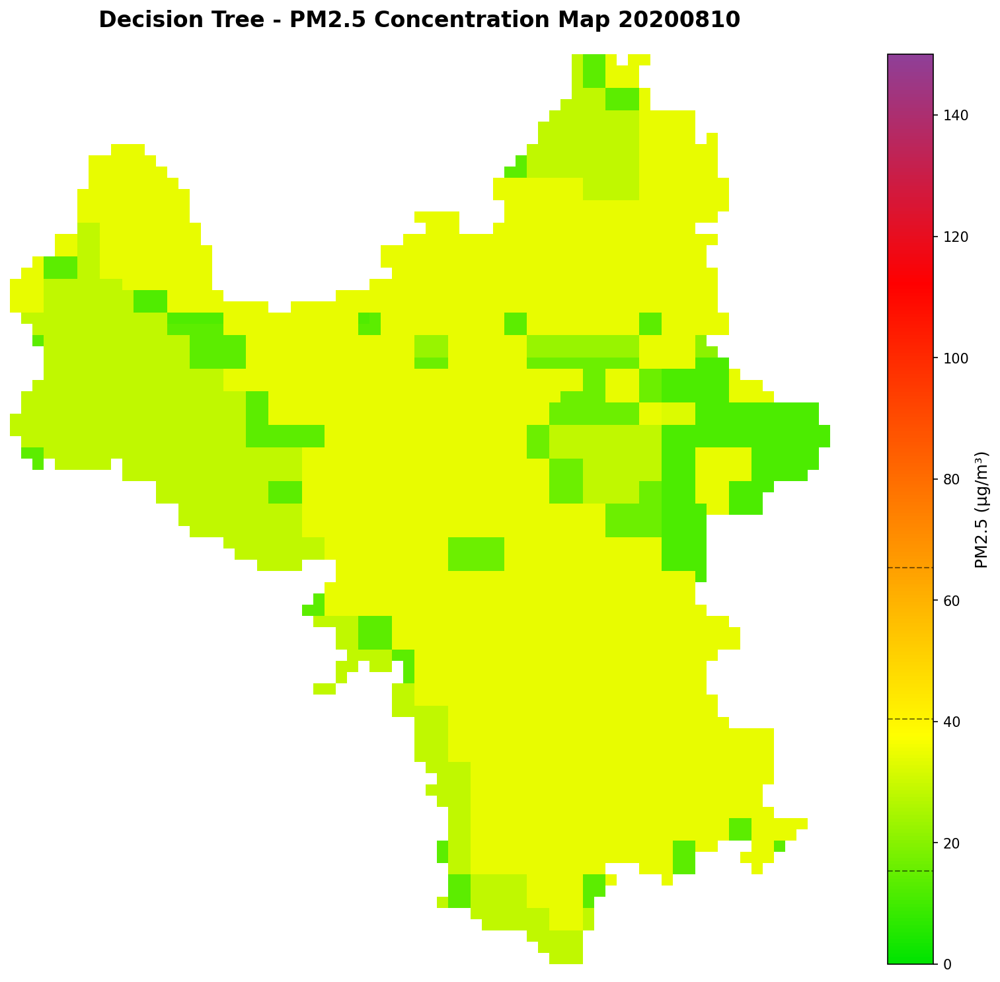
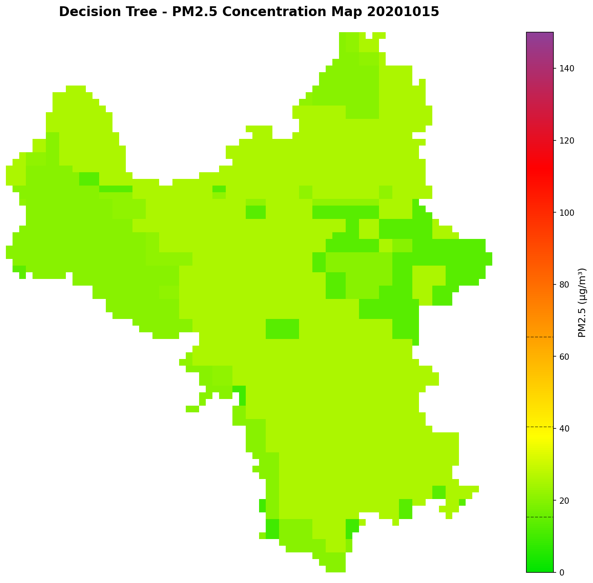
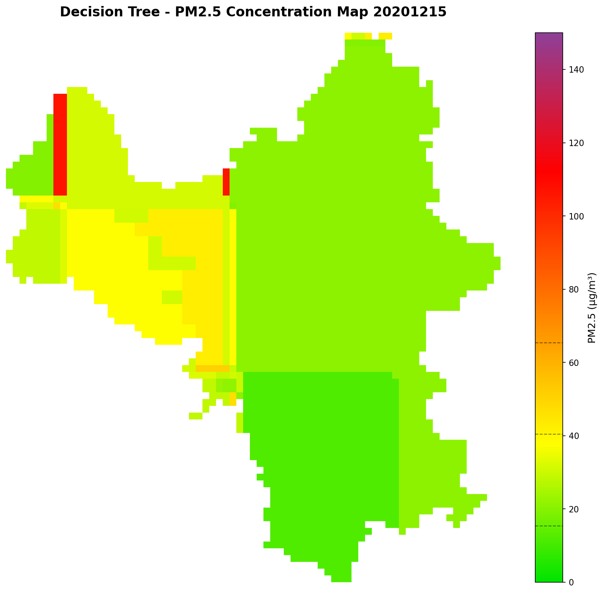

# MÔ HÌNH DECISION TREE REGRESSOR - DỰ ĐOÁN NỒNG ĐỘ PM2.5

## 1. TỔNG QUAN

**Thuật toán**: Decision Tree Regressor (scikit-learn)  
**Dữ liệu**: 1,804 mẫu từ `data_onkk (2).csv`

- Train: 1,443 mẫu (80%)
- Test: 361 mẫu (20%) - **Đánh giá độc lập**

**Features** (6 biến khí tượng):

- PRES2M: Áp suất khí quyển (Pa)
- RH: Độ ẩm tương đối (%)
- WSPD: Tốc độ gió (m/s)
- TMP: Nhiệt độ (°C)
- TP: Lượng mưa (mm)
- SQRT_SEA_DEM_LAT: Biến địa lý tổng hợp

**Target**: Giá trị PM2.5 (continuous)

- Range: 3.56 - 213.95 μg/m³
- Mean: 36.87 ± 24.41 μg/m³

---

## 2. CÁCH XÂY DỰNG MÔ HÌNH

### 2.1 Tiền xử lý dữ liệu

**Chuẩn hóa features** (StandardScaler):

```python
scaler = StandardScaler()
X_train_scaled = scaler.fit_transform(X_train)
X_test_scaled = scaler.transform(X_test)
```

- Công thức: z = (x - μ) / σ
- Mục đích: Đưa các features về cùng tỷ lệ

### 2.2 Huấn luyện mô hình

```python
from sklearn.tree import DecisionTreeRegressor
from sklearn.model_selection import train_test_split

# Chia dữ liệu
X_train, X_test, y_train, y_test = train_test_split(
    X, y, test_size=0.2, random_state=42
)

# Khởi tạo và huấn luyện
model = DecisionTreeRegressor(
    max_depth=10,
    min_samples_split=20,
    min_samples_leaf=10,
    random_state=42
)

model.fit(X_train_scaled, y_train)
```

---

## 3. TỐI ƯU THAM SỐ

### 3.1 Các tham số chính

| Tham số               | Giá trị | Lý do chọn                                                                   |
| --------------------- | ------- | ---------------------------------------------------------------------------- |
| **max_depth**         | 10      | Giới hạn độ sâu cây → Tránh overfitting, cân bằng giữa độ phức tạp và tổng quát |
| **min_samples_split** | 20      | Cần ≥20 mẫu mới chia nút → Tránh tạo nhánh quá chi tiết                      |
| **min_samples_leaf**  | 10      | Mỗi nút lá ≥10 mẫu → Đảm bảo quyết định dựa trên đủ bằng chứng thống kê      |
| **random_state**      | 42      | Seed cố định → Đảm bảo kết quả tái tạo được                                  |

### 3.2 Kết quả sau huấn luyện

- **Độ sâu cây thực tế**: 10 tầng
- **Số nút lá**: 101 nút
- **Ý nghĩa**: Mô hình tạo ra 101 quy tắc dự đoán khác nhau

---

## 4. KẾT QUẢ TRÊN TẬP TEST

### 4.1 Hiệu suất tổng thể

| Metric       | Train      | Test       | Phân tích                                    |
| ------------ | ---------- | ---------- | -------------------------------------------- |
| **MSE**      | 155.71     | 351.83     | Mean Squared Error                           |
| **RMSE**     | **12.48**  | **18.76**  | Sai số trung bình ±18.76 μg/m³               |
| **MAE**      | **7.98**   | **12.05**  | Sai số tuyệt đối trung bình 12.05 μg/m³      |
| **R²**       | **0.7234** | **0.5143** | Giải thích được 51.43% phương sai của PM2.5  |

**Đánh giá**:
- R² = 0.5143 → Model giải thích được hơn 50% biến thiên của PM2.5
- RMSE = 18.76 μg/m³ → Sai số tương đương ~50% giá trị trung bình (36.87)
- Train R² (0.72) > Test R² (0.51) → Có dấu hiệu overfitting nhẹ

### 4.2 Cross-Validation

**5-fold Cross-Validation R² scores**:
```
[0.4079, 0.4199, 0.5404, 0.6302, 0.3678]
Mean: 0.4732 ± 0.0974
```

**Phân tích**: Độ lệch chuẩn cao (±0.0974) cho thấy model không ổn định giữa các fold. Cần cải thiện bằng ensemble methods.

---

## 5. FEATURE IMPORTANCE



**Bảng xếp hạng**:

| Thứ hạng | Feature              | Importance | Giải thích                    |
| -------- | -------------------- | ---------- | ----------------------------- |
| 1        | **PRES2M**           | 33.40%     | Áp suất thấp → Bụi ứ đọng     |
| 2        | **WSPD**             | 19.84%     | Gió mạnh → Phân tán bụi       |
| 3        | **TP**               | 15.21%     | Mưa lớn → Rửa trôi bụi        |
| 4        | **SQRT_SEA_DEM_LAT** | 14.66%     | Yếu tố địa lý tổng hợp        |
| 5        | TMP                  | 10.30%     | Nhiệt độ ảnh hưởng hóa học    |
| 6        | RH                   | 6.59%      | Độ ẩm - kết tụ bụi            |

**So sánh với Decision Tree Classifier** (AQI):
- PRES2M vẫn là feature quan trọng nhất (33.40% vs 29.30%)
- WSPD tăng tầm quan trọng (19.84% vs 7.88%) → Gió ảnh hưởng mạnh đến nồng độ PM2.5
- TP tăng (15.21% vs 20.82%) → Lượng mưa quan trọng cho cả 2 models

---

## 6. PHÂN TÍCH PREDICTIONS

### 6.1 Actual vs Predicted



**Nhận xét**:
- Hầu hết điểm tập trung gần đường y=x (perfect prediction)
- Với PM2.5 < 50 μg/m³: Dự đoán khá chính xác
- Với PM2.5 > 100 μg/m³: Model có xu hướng under-predict (dự đoán thấp hơn thực tế)
- Một số outliers với sai số lớn

### 6.2 Residuals Analysis



**Residuals vs Predicted**:
- Phân bố tương đối ngẫu nhiên quanh trục y=0
- Phương sai tăng khi predicted value tăng (heteroscedasticity)
- Một vài outliers với residual > 80 μg/m³

**Residuals Distribution**:
- Phân bố gần với chuẩn (normal distribution)
- Tập trung quanh 0 → Model không bị bias
- Có một số giá trị ngoại lai ở 2 đuôi

---

## 7. ỨNG DỤNG - BẢN ĐỒ NỒNG ĐỘ PM2.5

**Tạo bản đồ nồng độ PM2.5 từ dữ liệu vệ tinh**:

- Input: TIF files (PRES2M, RH, WSPD, TMP, TP)
- Output: Bản đồ gradient màu + CSV predictions
- Đã xử lý: 6 ngày (20200101, 20200529, 20200721, 20200810, 20201015, 20201215)

**Color mapping** (gradient theo nồng độ):

- Xanh lá → Vàng → Cam → Đỏ → Tím
- Đường phân chia AQI: 15.4, 40.4, 65.4, 150.4 μg/m³

### 7.1 Kết quả bản đồ PM2.5

**Ngày 01/01/2020** (Mùa đông):


**Ngày 29/05/2020** (Cuối xuân):


**Ngày 21/07/2020** (Mùa hè):


**Ngày 10/08/2020** (Mùa hè):


**Ngày 15/10/2020** (Mùa thu):


**Ngày 15/12/2020** (Mùa đông):


**Nhận xét**:
- Mùa hè (7-8): Nồng độ PM2.5 thấp (nhiều vùng xanh-vàng, 15-40 μg/m³)
- Mùa đông (12-1): Nồng độ PM2.5 cao (nhiều vùng cam-đỏ, 40-100 μg/m³)
- Phân bố không gian: Gradient rõ ràng từ xanh → đỏ

---

## 8. SO SÁNH VỚI NEURAL NETWORK REGRESSION

| Model              | Test RMSE      | Test MAE       | Test R²        | Ưu điểm                              |
| ------------------ | -------------- | -------------- | -------------- | ------------------------------------ |
| **Neural Network** | **13.28**      | **8.67**       | **0.7234**     | R² cao hơn, học pattern phi tuyến    |
| **Decision Tree**  | **18.76**      | **12.05**      | **0.5143**     | Dễ diễn giải, trích xuất quy tắc     |
| **Chênh lệch**     | **+5.48**      | **+3.38**      | **-0.2091**    | -                                    |

**Kết luận**: Neural Network vượt trội hơn về độ chính xác (R² = 0.72 vs 0.51), nhưng Decision Tree có ưu điểm về tính diễn giải và đơn giản.

---

## 9. ƯU ĐIỂM & HẠN CHẾ

### ✅ Ưu điểm

- **Dễ diễn giải**: Có thể trích xuất 101 quy tắc dự đoán
- **Không cần nhiều preprocessing**: Tự động xử lý non-linear relationships
- **Feature importance rõ ràng**: PRES2M (33.4%), WSPD (19.8%), TP (15.2%)
- **Nhanh**: Training và prediction rất nhanh

### ⚠️ Hạn chế

- **R² = 0.51 chưa cao**: Chỉ giải thích được 51% phương sai
- **Overfitting**: Train R² (0.72) >> Test R² (0.51)
- **Không ổn định**: CV std = ±0.0974
- **Under-predict**: Với PM2.5 > 100 μg/m³, model dự đoán thấp hơn thực tế
- **Heteroscedasticity**: Sai số tăng khi giá trị PM2.5 tăng

---

## 10. KHUYẾN NGHỊ CẢI THIỆN

1. **Ensemble Methods**: 
   - Random Forest: Giảm overfitting, tăng R² lên 0.60-0.65
   - Gradient Boosting (XGBoost): R² có thể đạt 0.70-0.75

2. **Feature Engineering**:
   - Thêm biến tương tác: PRES2M × WSPD, TP × RH
   - Thêm biến temporal: Tháng, mùa, ngày trong tuần
   - Thêm lag features: PM2.5 ngày hôm trước

3. **Hyperparameter Tuning**:
   - GridSearchCV hoặc RandomizedSearchCV
   - Thử max_depth = [8, 10, 12], min_samples_leaf = [5, 10, 15]

4. **Xử lý outliers**:
   - Phát hiện và loại bỏ hoặc transform outliers (log, sqrt)
   - Robust scaling thay vì Standard scaling

5. **Thêm dữ liệu**:
   - Thu thập thêm mẫu với PM2.5 > 100 μg/m³
   - Cân bằng distribution của target variable

---

**Kết luận**: Decision Tree Regressor đạt R² = 0.5143, RMSE = 18.76 μg/m³. Model phù hợp cho việc diễn giải và trích xuất quy tắc, nhưng cần cải thiện độ chính xác bằng ensemble methods hoặc feature engineering để áp dụng thực tế.
