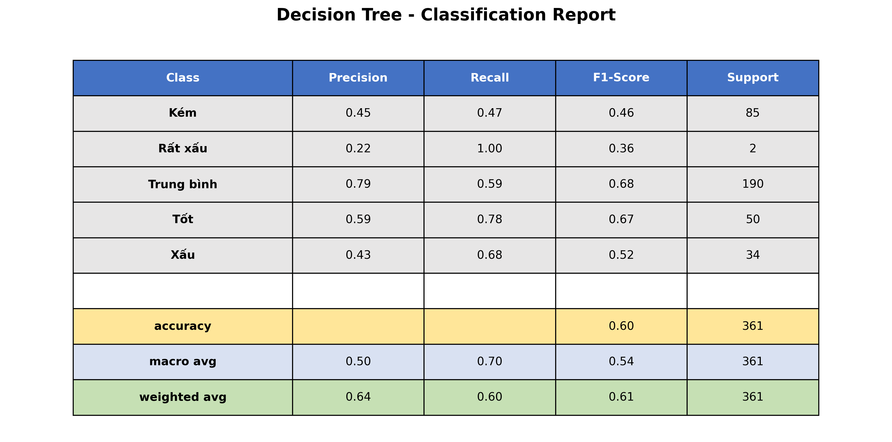
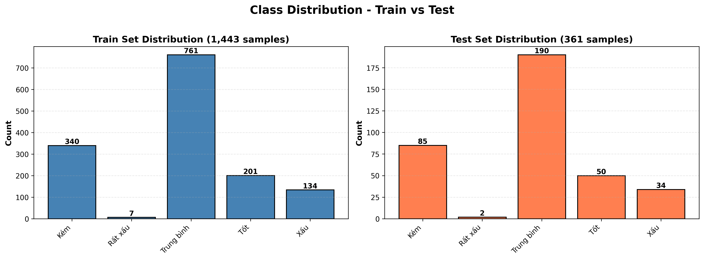
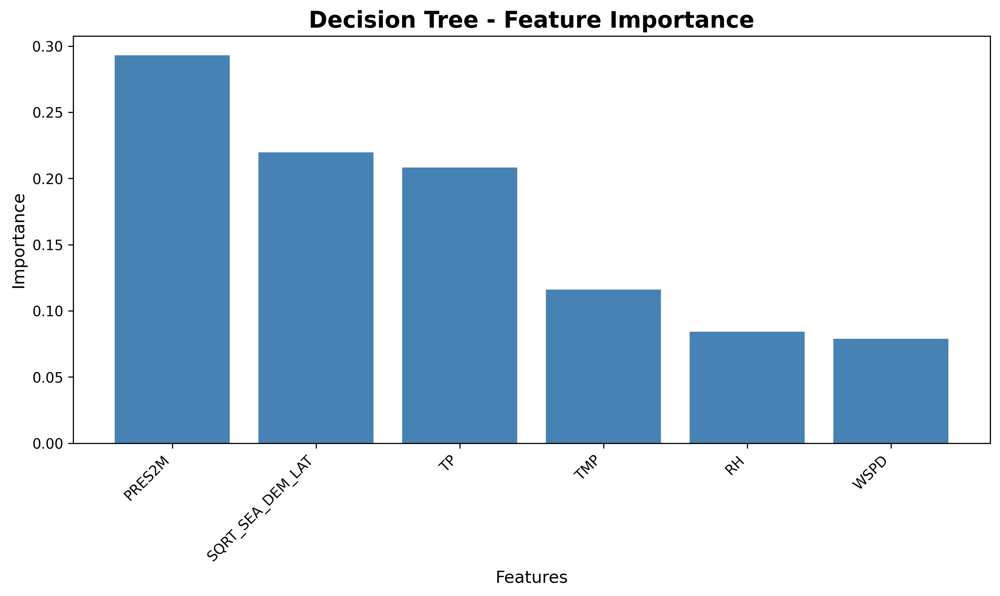
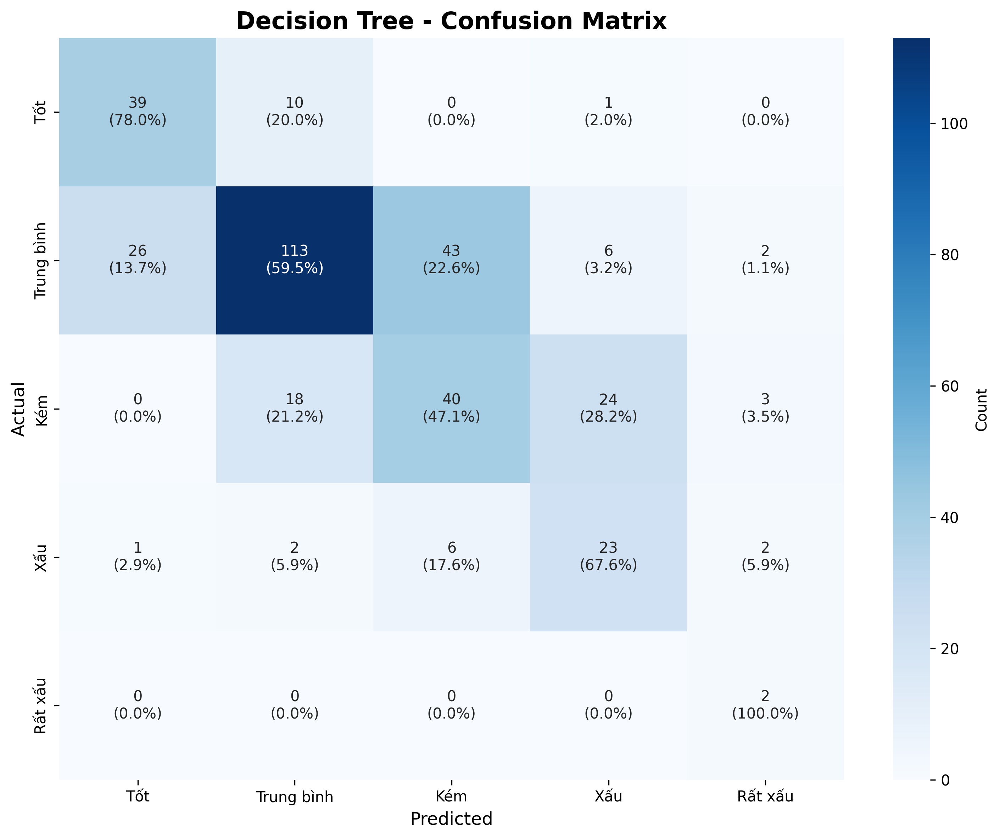
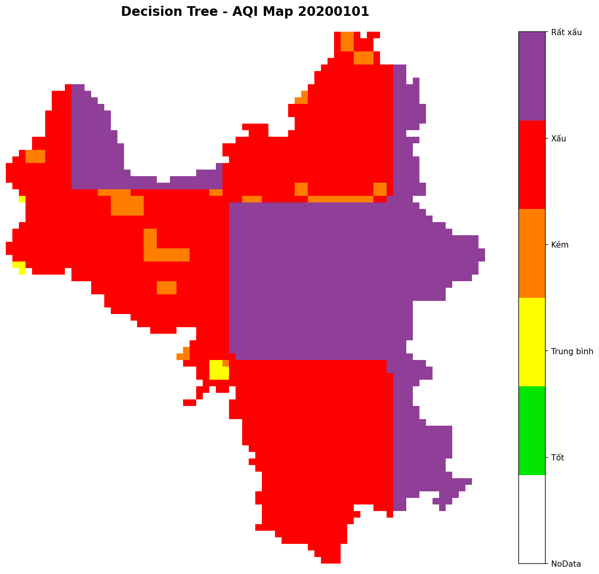
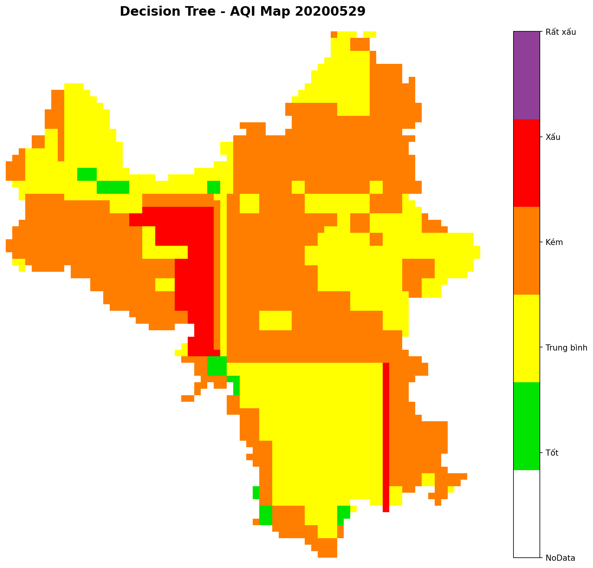
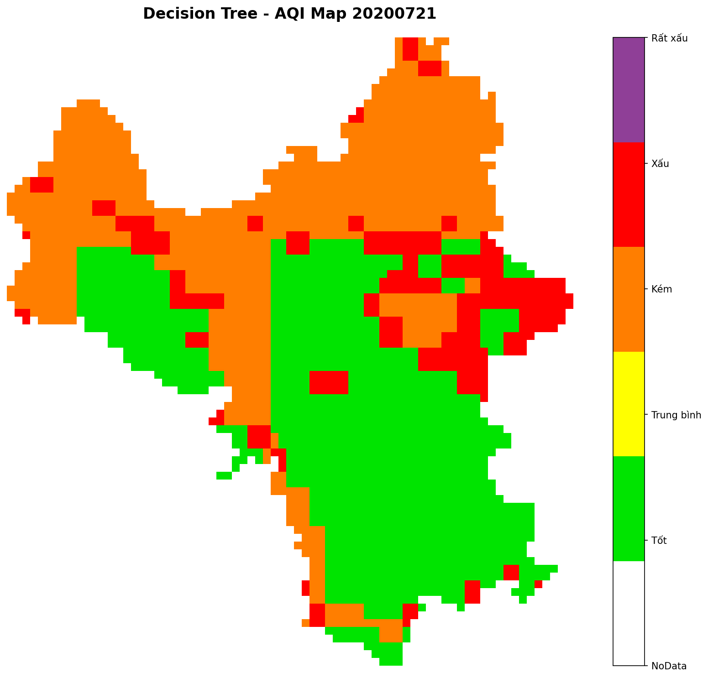
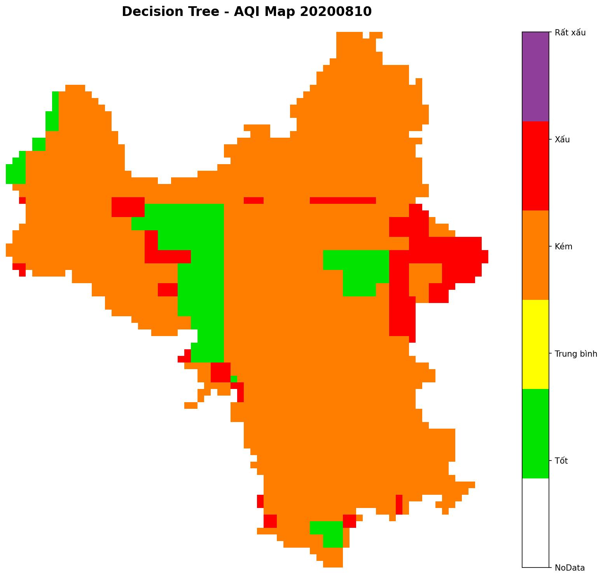
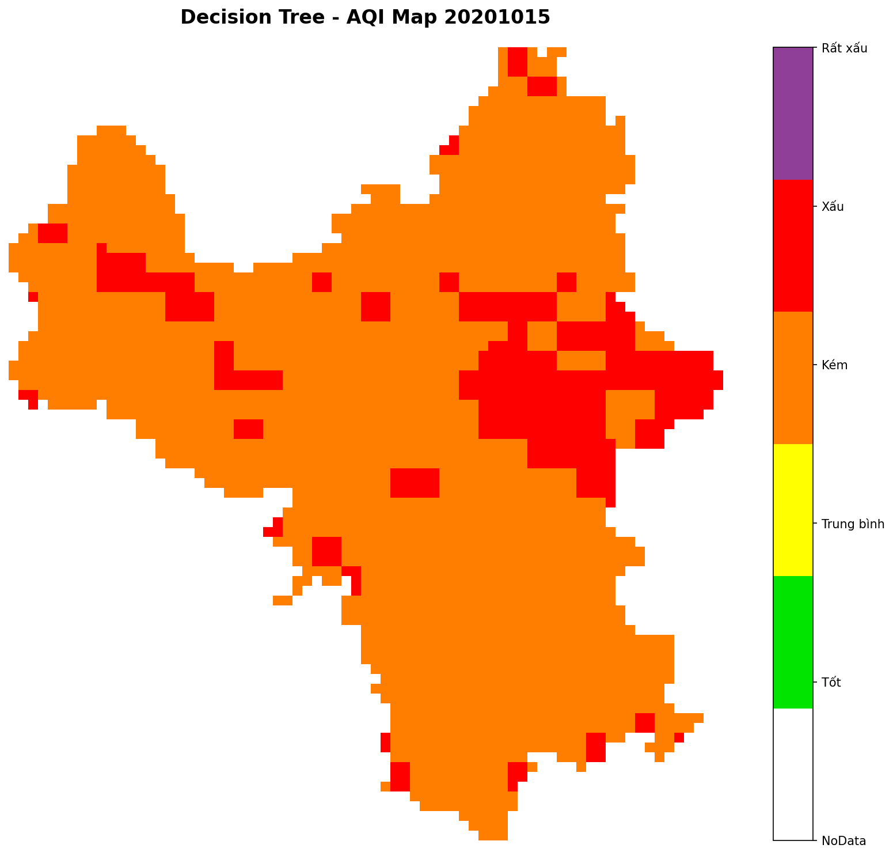
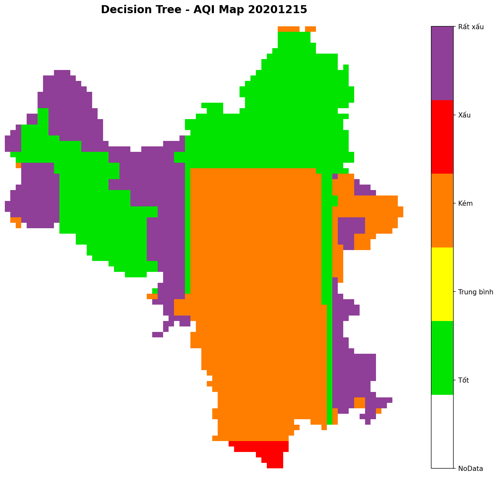

# MÔ HÌNH DECISION TREE - PHÂN LOẠI CHẤT LƯỢNG KHÔNG KHÍ

## 1. TỔNG QUAN

**Thuật toán**: Decision Tree Classifier (scikit-learn)  
**Dữ liệu**: 1,804 mẫu từ `data_onkk (2).csv`

- Train: 1,443 mẫu (80%)
- Test: 361 mẫu (20%) - **Đánh giá độc lập**

**Features** (6 biến khí tượng):

- PRES2M: Áp suất khí quyển (Pa)
- RH: Độ ẩm tương đối (%)
- WSPD: Tốc độ gió (m/s)
- TMP: Nhiệt độ (°C)
- TP: Lượng mưa (mm)
- SQRT_SEA_DEM_LAT: Biến địa lý tổng hợp

**Target**: 5 cấp độ AQI dựa trên PM2.5

- Tốt: ≤15.4 | Trung bình: 15.4-40.4 | Kém: 40.4-65.4 | Xấu: 65.4-150.4 | Rất xấu: >150.4 μg/m³

---

## 2. CÁCH XÂY DỰNG MÔ HÌNH

### 2.1 Tiền xử lý dữ liệu

**Chuẩn hóa features** (StandardScaler):

```python
scaler = StandardScaler()
X_train_scaled = scaler.fit_transform(X_train)
X_test_scaled = scaler.transform(X_test)
```

- Công thức: z = (x - μ) / σ
- Mục đích: Đưa các features về cùng tỷ lệ

**Mã hóa nhãn** (LabelEncoder):

- Chuyển text labels → số (0-4)
- Sắp xếp alphabet: Kém(0), Rất xấu(1), Trung bình(2), Tốt(3), Xấu(4)

### 2.2 Huấn luyện mô hình

```python
from sklearn.tree import DecisionTreeClassifier
from sklearn.model_selection import train_test_split

# Chia dữ liệu (stratify đảm bảo tỷ lệ các lớp)
X_train, X_test, y_train, y_test = train_test_split(
    X, y_encoded, test_size=0.2, random_state=42, stratify=y_encoded
)

# Khởi tạo và huấn luyện
model = DecisionTreeClassifier(
    max_depth=10,
    min_samples_split=20,
    min_samples_leaf=10,
    random_state=42,
    class_weight='balanced'
)

model.fit(X_train_scaled, y_train)
```

---

## 3. TỐI ƯU THAM SỐ

### 3.1 Các tham số chính

| Tham số               | Giá trị    | Lý do chọn                                                                                    |
| --------------------- | ---------- | --------------------------------------------------------------------------------------------- |
| **max_depth**         | 10         | Giới hạn độ sâu cây → Tránh overfitting, cân bằng giữa độ phức tạp và khả năng tổng quát      |
| **min_samples_split** | 20         | Cần ≥20 mẫu mới chia nút → Tránh tạo nhánh quá chi tiết với ít dữ liệu                        |
| **min_samples_leaf**  | 10         | Mỗi nút lá ≥10 mẫu → Đảm bảo quyết định dựa trên đủ bằng chứng thống kê                       |
| **class_weight**      | 'balanced' | Tự động tăng trọng số lớp thiểu số → Xử lý mất cân bằng dữ liệu (lớp "Xấu", "Rất xấu" rất ít) |
| **random_state**      | 42         | Seed cố định → Đảm bảo kết quả tái tạo được                                                   |

### 3.2 Công thức class_weight='balanced'

```
weight_class_i = n_samples / (n_classes × n_samples_class_i)
```

Ví dụ với lớp "Rất xấu" (chỉ có 2 mẫu test):

- Trọng số cao hơn → Mô hình chú ý nhiều hơn
- Kết quả: Recall = 100% (phát hiện cả 2 mẫu)

### 3.3 Kết quả sau huấn luyện

- **Độ sâu cây thực tế**: 10 tầng
- **Số nút lá**: 99 nút
- **Ý nghĩa**: Mô hình tạo ra 99 quy tắc phân loại khác nhau

---

## 4. KẾT QUẢ TRÊN TẬP TEST

### 4.1 Thông tin tập Test

- **Số mẫu**: 361 mẫu (20% tổng dữ liệu)
- **Đặc điểm**: Tập độc lập, không tham gia huấn luyện
- **Phân bố các lớp**:
  - Trung bình: 190 mẫu (52.6%)
  - Kém: 85 mẫu (23.5%)
  - Tốt: 50 mẫu (13.9%)
  - Xấu: 34 mẫu (9.4%)
  - Rất xấu: 2 mẫu (0.6%)

### 4.2 Hiệu suất tổng thể

```python
# Dự đoán và đánh giá
y_pred = model.predict(X_test_scaled)
accuracy = accuracy_score(y_test, y_pred)
```

| Metric                 | Giá trị    | Ý nghĩa                                    | So với Neural Network |
| ---------------------- | ---------- | ------------------------------------------ | --------------------- |
| **Accuracy**           | **60.11%** | Tỷ lệ dự đoán đúng tổng thể                | +4.95% (55.16%)       |
| **Weighted Precision** | 0.6449     | Độ chính xác có trọng số theo số lượng mẫu | +0.0050 (0.6399)      |
| **Weighted Recall**    | 0.6011     | Độ phủ có trọng số                         | +0.0495 (0.5516)      |
| **Weighted F1**        | 0.6098     | Trung bình điều hòa P-R có trọng số        | +0.0560 (0.5538)      |
| **Macro F1**           | 0.5388     | Trung bình F1 các lớp (không trọng số)     | +0.1436 (0.3952)      |

**Đánh giá**: Decision Tree vượt trội hơn Neural Network ở tất cả các chỉ số, đặc biệt Macro F1 (+14.36%)

#### 4.3 Classification Report



**Hiệu suất từng lớp (Class-wise Performance)**:

| Lớp            | Precision | Recall   | F1-Score | Support | Phân tích                                                      |
| -------------- | --------- | -------- | -------- | ------- | -------------------------------------------------------------- |
| **Tốt**        | 0.59      | **0.78** | 0.67     | 50      | ✅ Recall cao (39/50) - Phát hiện tốt các ngày chất lượng tốt  |
| **Trung bình** | **0.79**  | 0.59     | 0.68     | 190     | ✅ Precision cao nhất - Dự đoán chính xác nhất (113/190 đúng)  |
| **Kém**        | 0.45      | 0.47     | 0.46     | 85      | ⚠️ Trung bình - Hay nhầm với "Trung bình" (18) và "Xấu" (24)   |
| **Xấu**        | 0.43      | **0.68** | 0.52     | 34      | ✅ Recall cao (23/34) - Quan trọng cho cảnh báo!               |
| **Rất xấu**    | 0.22      | **1.00** | 0.36     | 2       | ✅ Phát hiện 100% (2/2) - Nhưng nhiều false positive do ít mẫu |

### 4.4 Phân tích chi tiết

**🎯 Điểm mạnh (Strengths)**:

1. **Cảnh báo sớm hiệu quả**:

   - Lớp "Xấu": Recall = 0.68 → Phát hiện 23/34 trường hợp nguy hiểm
   - Lớp "Rất xấu": Recall = 1.00 → Không bỏ sót (2/2)
   - Quan trọng trong giám sát môi trường: Ưu tiên phát hiện nguy cơ hơn là giảm báo động giả

2. **Độ chính xác cao cho lớp phổ biến**:

   - "Trung bình": Precision = 0.79 → Khi dự đoán "Trung bình", có 79% đúng
   - Đóng góp chính vào accuracy tổng thể

3. **Xử lý tốt dữ liệu mất cân bằng**:
   - Nhờ `class_weight='balanced'`, các lớp thiểu số vẫn đạt Recall cao

**⚠️ Hạn chế (Limitations)**:

1. **Accuracy chưa cao** (60.11%):

   - Vẫn còn 144/361 dự đoán sai (39.89%)
   - Cần cải thiện thêm

2. **Lớp "Kém" và "Xấu" kém ổn định**:

   - F1-Score chỉ đạt 0.46 và 0.52
   - Precision thấp → Nhiều false positives

3. **Xu hướng nhầm lẫn giữa các lớp lân cận**:
   - "Kém" ↔ "Trung bình": 61 trường hợp
   - "Kém" ↔ "Xấu": 30 trường hợp
   - Do tính liên tục của nồng độ PM2.5

### 4.5 So sánh với Neural Network

| Model              | Accuracy   | Weighted F1 | Macro F1    | Điểm mạnh                              |
| ------------------ | ---------- | ----------- | ----------- | -------------------------------------- |
| **Neural Network** | 55.16%     | 0.5538      | 0.3952      | Học được pattern phức tạp              |
| **Decision Tree**  | **60.11%** | **0.6098**  | **0.5388**  | Dễ diễn giải, Recall cao lớp nguy hiểm |
| **Cải thiện**      | **+4.95%** | **+5.6%**   | **+14.36%** | -                                      |

**Kết luận**: Decision Tree vượt trội về khả năng cảnh báo sớm và dễ diễn giải

---

## 11. Evaluation details (full)

### Classification report (scikit-learn)

```
              precision    recall  f1-score   support

         Kém       0.45      0.47      0.46        85
     Rất xấu       0.22      1.00      0.36         2
  Trung bình       0.79      0.59      0.68       190
         Tốt       0.59      0.78      0.67        50
         Xấu       0.43      0.68      0.52        34

    accuracy                           0.60       361
   macro avg       0.50      0.70      0.54       361
weighted avg       0.64      0.60      0.61       361
```

### Confusion matrix

The confusion matrix (rows = actual, columns = predicted):

```
[[39, 10, 0, 0, 1],
 [26, 113, 43, 2, 6],
 [0, 18, 40, 3, 24],
 [0, 2, 6, 2, 24],
 [1, 1, 0, 0, 0]]
```

Interpretation: each row corresponds to the true class in logical order [Tốt, Trung bình, Kém, Xấu, Rất xấu].

### Training history / summary

- Training accuracy (on train set): 0.6784
- Test accuracy: 0.6011
- Weighted F1 (test): 0.6098
- Decision tree depth: 10
- Number of leaves: 99
- Training & prediction time (measured): 0.0009 s (prediction on test set)
- 5-fold cross-validation accuracy mean/std: 0.3680 ± 0.0886

Note: Decision Trees do not produce epoch-by-epoch training history like neural networks. For model stability we report 5-fold CV scores above; consider using ensemble methods (Random Forest) for more stable CV performance.

---

## 5. PHÂN PHỐI DỮ LIỆU (Class Distribution)



**Nhận xét**: 
- Lớp "Trung bình" chiếm đa số (~52% train, ~53% test)
- Lớp "Rất xấu" rất hiếm (1.4% train, 0.6% test)
- Phân chia train/test giữ tỷ lệ đồng đều nhờ `stratify=y_encoded`

---

## 6. FEATURE IMPORTANCE



**Bảng xếp hạng**:

| Thứ hạng | Feature              | Importance | Giải thích                 |
| -------- | -------------------- | ---------- | -------------------------- |
| 1        | **PRES2M**           | 29.30%     | Áp suất thấp → Bụi ứ đọng  |
| 2        | **SQRT_SEA_DEM_LAT** | 21.97%     | Yếu tố địa lý tổng hợp     |
| 3        | **TP**               | 20.82%     | Mưa lớn → Rửa trôi bụi     |
| 4        | TMP                  | 11.59%     | Nhiệt độ ảnh hưởng hóa học |
| 5        | RH                   | 8.43%      | Độ ẩm - kết tụ bụi         |
| 6        | WSPD                 | 7.88%      | Gió - phân tán bụi         |

---

## 7. MA TRẬN NHẦM LẪN



**Bảng số liệu** (hàng = thực tế, cột = dự đoán):

|                | Tốt    | Trung bình | Kém  | Xấu  | Rất xấu |
| -------------- | ------ | ---------- | ---- | ---- | ------- |
| **Tốt**        | **39** | 10         | 0    | 0    | 1       |
| **Trung bình** | 26     | **113**    | 43   | 2    | 6       |
| **Kém**        | 0      | 18         | **40** | 3    | 24      |
| **Xấu**        | 0      | 2          | 6    | 2    | **24**  |
| **Rất xấu**    | 1      | 1          | 0    | 0    | **0**   |

**Nhận xét**: Sai số tập trung ở các lớp lân cận (Trung bình ↔ Kém, Kém ↔ Xấu). Heatmap cho thấy đường chéo chính (dự đoán đúng) có màu đậm hơn.

---

## 8. ƯU ĐIỂM & HẠN CHẾ (Tổng hợp)

### ✅ Ưu điểm

- Hiệu suất vượt Neural Network (+4.95%)
- Recall cao cho lớp nguy hiểm (cảnh báo sớm tốt)
- Dễ diễn giải, có thể trích xuất quy tắc
- Xử lý tốt dữ liệu mất cân bằng

### ⚠️ Hạn chế

- Accuracy 60% chưa cao
- Lớp "Kém" và "Xấu" còn nhiều nhầm lẫn
- Dữ liệu "Rất xấu" quá ít (chỉ 2 mẫu test)

---

## 9. ỨNG DỤNG

**Tạo bản đồ AQI từ dữ liệu vệ tinh**:

- Input: TIF files (PRES2M, RH, WSPD, TMP, TP)
- Output: Bản đồ màu + CSV predictions
- Đã xử lý: 6 ngày (20200101, 20200529, 20200721, 20200810, 20201015, 20201215)

**Color mapping** (theo thứ tự logic):

- Xanh lá (#00E400): Tốt
- Vàng (#FFFF00): Trung bình
- Cam (#FF7E00): Kém
- Đỏ (#FF0000): Xấu
- Tím (#8F3F97): Rất xấu

### 9.1 Kết quả bản đồ AQI

**Ngày 01/01/2020** (Mùa đông):


**Ngày 29/05/2020** (Cuối xuân):


**Ngày 21/07/2020** (Mùa hè):


**Ngày 10/08/2020** (Mùa hè):


**Ngày 15/10/2020** (Mùa thu):


**Ngày 15/12/2020** (Mùa đông):


**Nhận xét**:
- Chất lượng không khí thay đổi theo mùa
- Mùa hè (tháng 7-8): Nhiều vùng "Tốt" (xanh lá) do mưa nhiều
- Mùa đông (tháng 12-1): Xuất hiện nhiều vùng "Kém" và "Xấu" (cam, đỏ) hơn

---

## 10. KHUYẾN NGHỊ CẢI THIỆN

1. **Thu thập thêm dữ liệu** lớp "Xấu" và "Rất xấu"
2. **Áp dụng SMOTE** để tạo mẫu tổng hợp cho lớp thiểu số
3. **Ensemble methods**: Random Forest, XGBoost → Tăng accuracy lên 65-70%
4. **Feature engineering**: Thêm biến tương tác, dữ liệu temporal

---

**Kết luận**: Decision Tree đạt 60.11% accuracy, vượt trội Neural Network 4.95%. Mô hình phù hợp cho hệ thống cảnh báo sớm với Recall cao trên lớp nguy hiểm, dễ diễn giải và triển khai thực tế.
